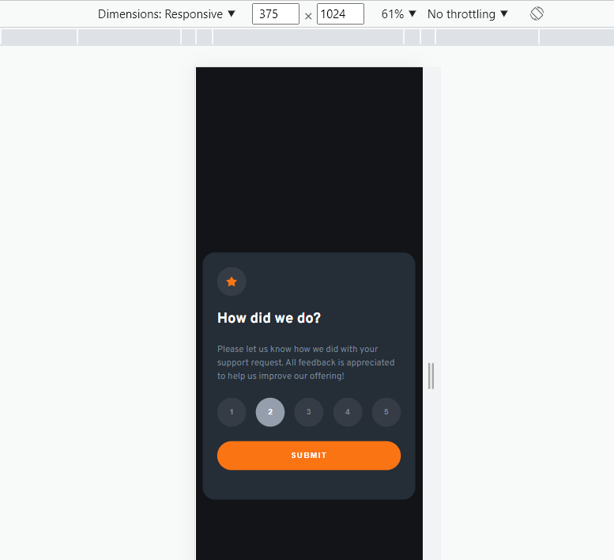
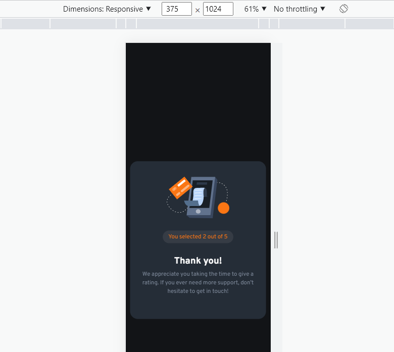

# Frontend Mentor - Interactive rating component solution

This is a solution to the [Interactive rating component challenge on Frontend Mentor](https://www.frontendmentor.io/challenges/interactive-rating-component-koxpeBUmI). Frontend Mentor challenges help you improve your coding skills by building realistic projects.

## Table of contents

- [Overview](#overview)
  - [The challenge](#the-challenge)
  - [Screenshot](#screenshot)
  - [Links](#links)
- [My process](#my-process)
  - [Built with](#built-with)
  - [Continued development](#continued-development)
- [Author](#author)

**Note: Delete this note and update the table of contents based on what sections you keep.**

## Overview

### The challenge

Users should be able to:

- View the optimal layout for the app depending on their device's screen size
- See hover states for all interactive elements on the page
- Select and submit a number rating
- See the "Thank you" card state after submitting a rating

### Screenshot

Desktop - Submit

Desktop - Thank you

Mobile - Submit

Mobile - Thank you

### Links

- Solution URL: [https://github.com/JoseLuisPB/FEM-Interactive-Rating-Component]
- Live Site URL: [https://joseluispb-frontend-mentor-interactive-rating-component.vercel.app/]

## My process

### Built with

- Semantic HTML5 markup
- CSS custom properties
- Flexbox
- Vanilla Javascript
- SCSS /SASS as CSS preprocesor

### Continued development

On future projects I want to focus in animations because it is something I do not practice very often and gives the component a more profesional look.

**Note: Delete this note and the content within this section and replace with your own plans for continued development.**

## Author

- Frontend Mentor - [https://www.frontendmentor.io/profile/JoseLuisPB]
